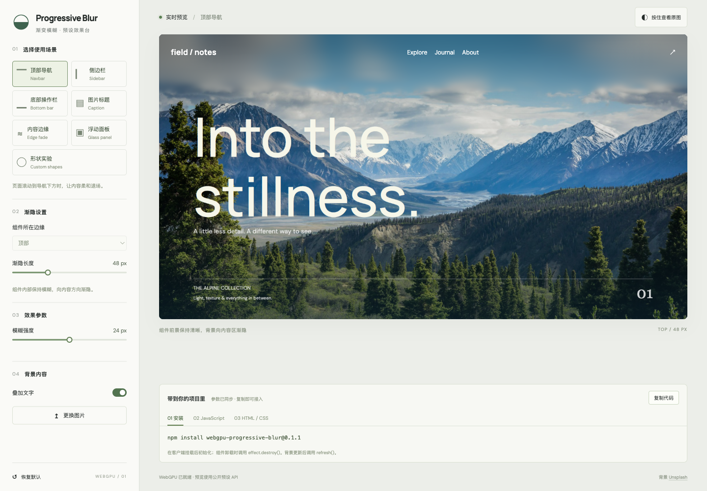
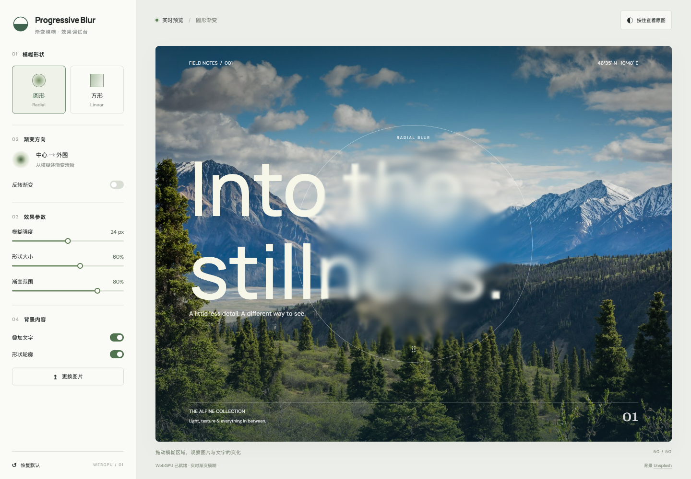
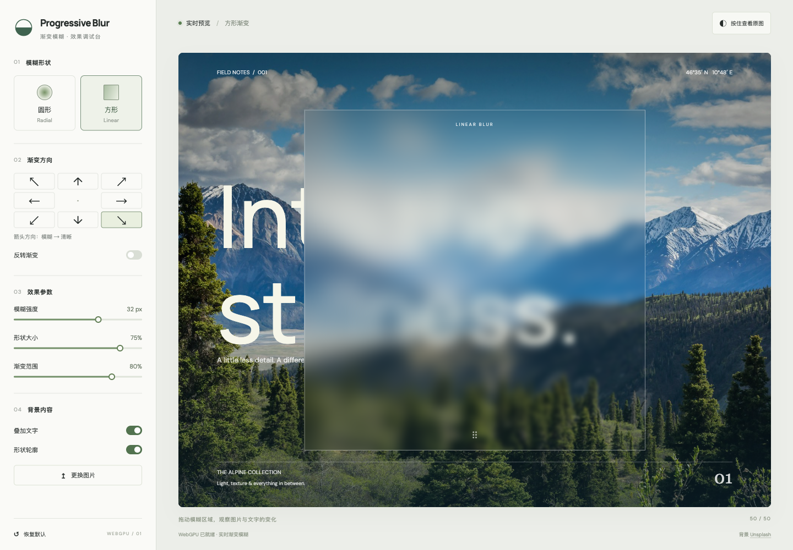
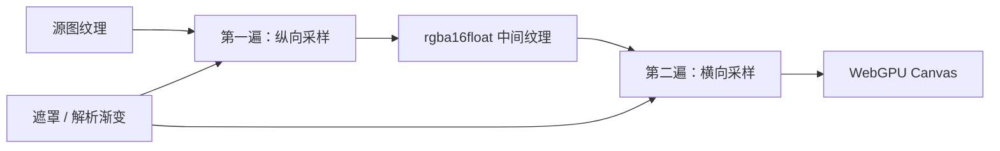

# WebGPU Progressive Blur

[](LICENSE)

基于 **TypeScript、WebGPU 和 WGSL** 的渐变模糊库。让模糊强度随位置连续变化：从中心向外逐渐清晰、从一侧向另一侧过渡，或通过自定义遮罩定义模糊区域。

仓库同时提供一个可交互的预设效果台：选择导航栏、侧栏等场景，调整参数，直接复制安装命令、JavaScript 和 HTML / CSS 接入代码。预览与接入代码使用同一套公开 API。核心库无框架绑定，可接入 Canvas、图像源或 DOM 界面。

当前为 `0.1.1` 预览版本。算法参考 Inferno 的可变半径模糊，以 WGSL 重写；来源与授权见[致谢](#致谢)和 [第三方声明](THIRD_PARTY_NOTICES.md)。

[效果预览](#效果预览) · [本地运行](#本地运行) · [在项目中使用](#在项目中使用) · [实现原理](#实现原理) · [部署](#部署) · [开发与验证](#开发与验证)

## 效果预览

### 选择预设，复制到项目



支持 navbar、左右 sidebar、bottom-bar、图片 caption、四边 edge 和均匀模糊 panel。形状实验继续提供径向及任意方向渐变。

以下截图来自本仓库的实际 WebGPU 调试台，图片与文字均参与模糊。

### 圆形：中心模糊，向外围逐渐清晰



### 方形：沿斜对角方向逐渐清晰



调试台支持：

- **形状与方向**：圆形径向渐变、方形八方向渐变，以及反转渐变。
- **实时参数**：模糊强度、形状大小、渐变范围。
- **交互对比**：拖动模糊区域，或聚焦后用方向键移动；按住按钮查看原图，松开恢复。
- **背景内容**：本地换图、文字开关和轮廓开关。选择的图片仅在浏览器内读取。
- **响应式布局**：桌面为左右分栏，手机为上下布局。

## 本地运行

开发环境使用 **Node.js 22.12+** 和 npm。浏览器需要能创建 WebGPU device；实际可用性取决于浏览器、系统和 GPU 环境。

```bash
git clone https://github.com/lliooly/webgpu-progressive-blur.git
cd webgpu-progressive-blur
npm ci
npm run dev
```

打开终端显示的地址，默认是 `http://127.0.0.1:4173/`。端口占用时，Vite 会选择下一个可用端口。

页面底部出现「WebGPU 已就绪」后即可操作。不支持 WebGPU 时，调试台保留原图并显示提示。

## 在项目中使用

### 安装

```bash
npm install webgpu-progressive-blur@0.1.1
```

如果需要使用工作区中的修改，也可以从源码打包。在本仓库执行：

```bash
npm ci
npm run build:lib
npm pack
```

当前版本会生成 `webgpu-progressive-blur-0.1.1.tgz`。在你的应用目录中安装生成的文件：

```bash
npm install /path/to/webgpu-progressive-blur-0.1.1.tgz
```

包提供 3 个 ESM 入口，并附带 TypeScript 声明。新版 TypeScript 已包含 WebGPU 类型；如果旧版编译器提示无法识别 `GPUDevice` 等名称，可执行 `npm install -D @webgpu/types`，并在该项目的 `tsconfig.json` 的 `compilerOptions.types` 中追加 `"@webgpu/types"`。库不会强制注入全局类型，避免与新版 DOM 类型冲突。

包入口：

| 入口 | 用途 |
| --- | --- |
| `webgpu-progressive-blur` | 核心渲染器、设备检测、CPU 参考算法 |
| `webgpu-progressive-blur/dom` | DOM 元素挂载、捕获与生命周期适配 |
| `webgpu-progressive-blur/shaders` | 原始 WGSL 字符串 `variableBlurWgsl` |

### 组件预设：从效果台到实际项目

在效果台选择场景，调整模糊强度和渐隐长度，然后依次复制「安装」「JavaScript」「HTML / CSS」。接入已有项目时，保留自己的布局和前景内容，将代码挂载到目标元素即可。

```ts
import { attachProgressiveBlur } from 'webgpu-progressive-blur/dom';

const navbar = document.querySelector<HTMLElement>('.my-navbar')!;
const effect = await attachProgressiveBlur(navbar, {
  preset: 'navbar',
  radius: 24,
  transition: 48,
});

// 背景内容变化后：await effect.refresh();
// 组件卸载时：effect.destroy();
```

| `preset` | `placement` | 行为 |
| --- | --- | --- |
| `navbar` | `top` | 顶部导航内部保持模糊，向下渐隐 |
| `sidebar` | `left` / `right` | 侧栏内部保持模糊，向正文方向渐隐 |
| `bottom-bar` | `bottom` | 底部工具栏、输入区或播放器，向上渐隐 |
| `caption` | `bottom` / `top` | 图片标题区域保持模糊，向图片内部渐隐 |
| `edge` | `top` / `bottom` / `left` / `right` | 装饰性边缘条，向内容区渐隐 |
| `panel` | 无需设置 | 整个面板均匀模糊，不增加外延 |

`placement` 表示组件所在边缘，不是模糊方向；默认采用表格中的第一个位置。`transition` 是元素外部渐隐长度，单位为 CSS px，默认 `48`，可以为 `0`；`panel` 忽略渐隐长度。库自动生成并缓存遮罩，跟随尺寸变化更新。

预设只提供效果，不创建导航项、按钮或布局。目标元素应有尺寸且背景透明；祖先的 `overflow: hidden` 可能裁掉外延，需要根据页面布局安排。前景文字保持清晰。React、Vue、Astro 等项目应在客户端挂载后初始化，卸载时调用 `destroy()`。

`preset` 与 `profile`、`overlay.bleed` 不能同时设置。可以通过 `setParameters({ preset: 'sidebar', placement: 'right' })` 切换预设；切换预设或 profile 会安排异步刷新，若需等待完成则使用 `await effect.refresh()`。单独修改半径后仍需 `effect.render()`。

高级形状无需手绘 mask：`profile: { type: 'radial', transition: 0.8, reverse: false }` 或 `profile: { type: 'directional', direction: [1, 1], transition: 0.8 }`。这里 `transition` 是 `(0, 1]` 内的比例，与组件预设的 CSS 像素长度不同。

### Canvas：创建一个径向渐变模糊

下面的示例适用于 Vite 等支持 TypeScript、ESM 的前端项目。它创建文字背景和径向 Alpha 遮罩，再将结果输出到 WebGPU canvas。

```ts
import { createProgressiveBlur } from 'webgpu-progressive-blur';

const width = 640;
const height = 400;
const pixelRatio = Math.min(window.devicePixelRatio || 1, 2);

const source = document.createElement('canvas');
const mask = document.createElement('canvas');
for (const canvas of [source, mask]) {
  canvas.width = Math.round(width * pixelRatio);
  canvas.height = Math.round(height * pixelRatio);
}

const context = source.getContext('2d', { alpha: false })!;
context.scale(pixelRatio, pixelRatio);
context.fillStyle = '#e8eddf';
context.fillRect(0, 0, width, height);
context.fillStyle = '#263b32';
context.font = '64px sans-serif';
context.fillText('Progressive blur', 40, 190);
context.font = '18px sans-serif';
context.fillText('从模糊到清晰，连续改变采样半径。', 44, 235);

const maskContext = mask.getContext('2d')!;
maskContext.scale(pixelRatio, pixelRatio);
const gradient = maskContext.createRadialGradient(
  width / 2, height / 2, 0,
  width / 2, height / 2, height / 2,
);
gradient.addColorStop(0, 'rgba(255, 255, 255, 1)');
gradient.addColorStop(1, 'rgba(255, 255, 255, 0)');
maskContext.fillStyle = gradient;
maskContext.fillRect(0, 0, width, height);

const output = document.createElement('canvas');
output.style.width = `${width}px`;
output.style.height = `${height}px`;
document.body.append(output);

try {
  const blur = await createProgressiveBlur({
    canvas: output,
    source,
    mask,
    mode: 'reference',
    radius: 24,
    maxSamples: 32,
    pixelRatio,
    normalizeEdges: true,
    // 此例的 source 是不透明 Canvas，可使用直传路径。
    canvasUploadMode: 'external',
    cacheMask: true,
  });

  blur.render();

  // 更新参数后显式提交下一帧。
  // blur.setParameters({ radius: 12 });
  // blur.render();

  // 组件卸载时释放资源：blur.destroy();
} catch (error) {
  output.replaceWith(source);
  console.warn('WebGPU 模糊不可用，显示原始内容。', error);
}
```

源图与遮罩应匹配渲染器的物理尺寸，即 `CSS 尺寸 × pixelRatio`。尺寸变化时调用 `resize(width, height, pixelRatio)`，同步重绘源图与遮罩，再调用 `render()`。已经获取过 `2d` context 的 canvas 不能再作为 WebGPU 输出，需像上例一样使用独立 canvas。

遮罩的 **Alpha 通道控制半径**：`0` 表示该位置不模糊，`1` 表示最大强度。它不直接改变输出的透明度；省略遮罩时，`reference` 模式使用全强度遮罩。开启 `cacheMask` 后，原地修改遮罩需调用 `invalidateMask()`；替换遮罩则调用 `setMask()`。

### 内置纵向渐变

如果只需要从上到下或从下到上的渐变，可省去遮罩，使用 `navbar` 模式。在上例的 `try` 块中，用以下内容替换渲染器的创建与首次渲染：

```ts
const blur = await createProgressiveBlur({
  canvas: output,
  source,
  pixelRatio,
  radius: 24,
  mode: 'navbar',
  gradient: {
    start: 0,
    end: 1,
    direction: 'top-to-bottom',
  },
});
blur.render();
```

`top-to-bottom` 表示顶部最模糊、底部最清晰，`bottom-to-top` 相反。`start`、`end` 是归一化纵向坐标，通常设置为 `0 ≤ start < end ≤ 1`。**横向、斜向和圆形渐变使用 `reference` 模式及遮罩**；DOM 入口的 `radial` / `directional` profile 会自动生成遮罩。它们不是核心 `gradient.direction` 的内置选项。

### DOM：挂载到界面元素

DOM 入口自动管理覆盖 canvas、场景捕获、滚动裁剪和尺寸变化。目标元素需要有尺寸，并允许背景透出：

```html
<div id="glass-card" style="width: 320px; height: 180px; background: transparent;">
  <h2>保持前景文字清晰</h2>
</div>
```

```ts
import { attachProgressiveBlur } from 'webgpu-progressive-blur/dom';

const element = document.querySelector<HTMLElement>('#glass-card')!;
const effect = await attachProgressiveBlur(element, {
  radius: 18,
  profile: {
    type: 'linear',
    start: 0,
    end: 1,
    direction: 'top-to-bottom',
  },
});

// 页面背景内容变化后重新捕获。
await effect.refresh();

// 参数更新本身不提交帧。
effect.setParameters({ radius: 22 });
effect.render();

// 组件卸载时：effect.destroy();
```

`profile` 还支持 `'uniform'`、`'navbar'` 和 `{ type: 'mask', source: maskCanvas }`。默认捕获器使用 `html2canvas` 捕获背景场景，排除目标元素，因而前景内容保持清晰；这与调试台将文字绘入源图的方式不同。

默认滚动策略复用场景快照，内容变化可调用 `refresh()`。复杂页面可传入 `captureRoot`、`scrollTarget` 或自定义 `capture`。DOM 捕获并非浏览器原生的实时 backdrop 读取，跨域图片、视频、复杂 CSS 与动态内容需要在目标页面验证。

详细类型见 [元素级 API](src/dom/element.ts)、[底层 DOM 适配器](src/dom/adapter.ts) 和 [捕获实现](src/dom/capture.ts)。

### 核心参数与生命周期

| 参数 | 默认值 | 说明 |
| --- | --- | --- |
| `radius` | `16` | CSS 像素单位的高斯标准差 σ，不是采样支持半径 |
| `maxSamples` | `15` | 每个轴的单侧采样预算，最大 `64` |
| `mode` | `'navbar'` | 内置纵向渐变或 `'reference'` 遮罩模式 |
| `verticalPassFirst` | `true` | 先纵向、再横向；可调整顺序 |
| `normalizeEdges` | `true` | 排除越界样本并重新归一化权重 |
| `pixelRatio` | 浏览器 DPR | CSS 到物理像素的比例，渲染器限制在 `0.5–4` |
| `canvasUploadMode` | `'readback'` | Canvas 回读路径；`'external'` 使用外部图像直传 |
| `cacheMask` | `false` | 缓存非 GPU 遮罩，内容变化时需显式失效 |

以上是核心渲染器默认值。DOM 挂载入口默认启用 `canvasUploadMode: 'external'` 和 `cacheMask: true`。

| 方法 | 用途 |
| --- | --- |
| `setSource(source)` | 替换源图；支持 `GPUTexture` 和 WebGPU 外部图像源 |
| `setMask(mask)` / `invalidateMask()` | 替换遮罩或使遮罩上传缓存失效 |
| `setParameters(options)` | 更新模糊参数，不自动渲染 |
| `resize(width, height, pixelRatio)` | 按 CSS 尺寸配置输出与中间纹理 |
| `render()` | 提交两遍渲染 |
| `destroy()` | 释放渲染器持有的资源；销毁后不可继续使用 |

可通过 `status` 查看状态。`getWebGPUCapability()` 仅检测 API 是否存在，实际创建设备仍可能失败，需要处理 `createProgressiveBlur()` 的异常。完整契约见 [核心类型](src/core/types.ts)。

## 实现原理

### 1. 每个像素拥有自己的模糊半径

设用户参数为 `radius`，设备像素比为 `DPR`，当前位置的遮罩强度为 `m(p) ∈ [0, 1]`：

```text
σ(p) = radius × DPR × m(p)
R(p) = 3 × σ(p)
```

`σ` 决定高斯分布的宽度，`R` 是实际采样的支持半径。遮罩越透明，采样范围越小；当 `R < 1` 个物理像素时，当前 pass 直接读取输入像素。

这种渐变来自采样半径的变化，而不是先生成一张固定模糊图，再用透明度混合。入口和参数换算见 [blur-params.ts](src/core/blur-params.ts) 与 [WGSL Shader](src/shaders/variable-blur.wgsl.ts)。

### 2. 两遍轴向高斯采样



每一遍沿一个轴采样中心像素及其两侧的像素，用高斯权重累加后归一化：

```text
w(d) ∝ exp(−d² / (2σ²))
输出颜色 = Σ(采样颜色 × 权重) / Σ权重
```

Shader 保留上游的 `1 / (2πσ²)` 权重前因子；同一输出像素的 σ 固定，该因子在最终归一化时抵消。

固定半径的高斯核可分离成横纵两遍，避免直接遍历二维邻域。这里沿用两遍结构处理空间变化的半径：**它不等价于任意位置可变高斯核的精确二维卷积**，两遍的顺序也可能影响结果，所以保留 `verticalPassFirst` 参数。

采样步长由当前支持半径和预算决定：

```text
step = max(1, R / maxSamples)
```

每个轴最多执行 `maxSamples` 次正负对称采样，外加中心像素。预算为 `64` 时，一遍最多读取 `129` 个源图样本；这不是“两遍总共 64 次采样”。大半径下步长会增大，成本受预算约束，细节质量也受预算影响。

### 3. WGSL 与渲染管线如何构建

[variable-blur.wgsl.ts](src/shaders/variable-blur.wgsl.ts) 导出 WGSL 字符串。渲染器初始化时通过 `device.createShaderModule()` 创建模块，然后创建面向中间纹理和最终输出格式的两个 render pipeline，共用同一组顶点与片元入口。

- **顶点阶段 `vertexMain`**：根据 `vertex_index` 生成一个覆盖屏幕的三角形，无需顶点缓冲区；每遍调用 `draw(3)`。
- **片元阶段 `fragmentMain`**：从像素坐标计算 UV，读取模糊强度，计算当前支持半径，选择采样轴并执行高斯累加。
- **资源绑定**：源纹理、线性采样器、uniform buffer、遮罩纹理、遮罩采样器，分别使用 binding `0–4`。
- **参数布局**：48 字节 uniform，包含尺寸、倒数尺寸、支持半径、采样预算、轴、模式、渐变参数和边缘策略。
- **两遍提交**：各自使用独立 uniform buffer，避免同一提交中的轴参数互相覆盖；一个 command encoder 编码两遍，再提交给队列。
- **纹理格式**：外部源图和遮罩的上传纹理使用 `rgba8unorm`，中间结果使用 `rgba16float`；最终输出采用所选 canvas 格式。

具体实现见 [blur-pass.ts](src/core/blur-pass.ts) 和 [renderer.ts](src/core/renderer.ts)。这是 render pass 管线，不使用 compute shader。

### 4. 渐变遮罩与形状

`reference` 模式只读取遮罩纹理的 Alpha；`navbar` 模式在 Shader 内根据 `uv.y`、`start`、`end` 和方向解析出强度。

DOM 预设与形状 profile 在 [presets.ts](src/dom/presets.ts) 中用 Canvas 2D 生成遮罩，组件内部保持全强度，元素外部按渐隐长度过渡。形状实验使用以下规则：

- **圆形**：按到圆心的距离生成径向 Alpha 渐变，默认圆心为 `1`、外围为 `0`。
- **方形**：将像素位置投影到选定方向，生成横向、纵向或斜向渐变。对角方向按方形角点投影确定完整跨度。
- **渐变范围**：决定从全模糊到全清晰的过渡长度；反转交换两端强度。

遮罩控制模糊强度，CSS 轮廓裁剪控制可见形状。两者分工独立，新增形状通常可以从遮罩和裁剪入手，无需修改核心 Shader。

### 5. 边缘、上传与性能

纹理外部被视为透明。`normalizeEdges: true` 时跳过越界样本，并只用有效样本的权重归一化；关闭时越界透明样本仍计入权重，边缘可能淡出。采样器使用线性过滤，但越界处理由 Shader 显式控制。

渲染器缓存稳定的 bind group，重复传入同尺寸时不会重建纹理。Canvas 默认回读上传；对于已确认兼容的不透明源，可用 `canvasUploadMode: 'external'` 调用 `copyExternalImageToTexture()`，减少 CPU 回读。透明源的 Alpha 表现需要单独验证。

调试台只渲染模糊区域及约 `3σ` 的额外采样边界，并限制 DPR；照片和文字仅在背景或尺寸变化时重绘。指针和参数更新通过 `requestAnimationFrame` 合并，静止时不持续提交帧。缓存遮罩仅在内容改变时重新上传。

## 部署

### 部署效果调试台

这是静态前端，无需应用后端。在仓库根目录构建：

```bash
npm ci
npm run build:demo
```

将 **`examples/navbar/dist/`** 中的内容部署到静态托管服务。不要上传根目录的 `dist/`：它是库的 JavaScript 与类型产物，不是网站。

| 托管配置 | 值 |
| --- | --- |
| 项目根目录 | 仓库根目录 |
| 安装命令 | `npm ci` |
| 构建命令 | `npm run build:demo` |
| 发布目录 | `examples/navbar/dist` |
| Node.js | `22.12+` |

部署前可以本地预览生产产物：

```bash
npx vite preview --config vite.config.ts --host 127.0.0.1 --port 4175
```

`vite preview` 用于本地检查，不作为生产服务器。静态托管流程可参考 [Vite 官方部署文档](https://vite.dev/guide/static-deploy.html)。

### 子路径与 GitHub Pages

部署到 `https://<用户>.github.io/webgpu-progressive-blur/` 这样的子路径时，构建时设置对应的 `base`：

```bash
npm run build:demo -- --base=/webgpu-progressive-blur/
```

发布目录仍为 `examples/navbar/dist/`。如果使用 GitHub Actions，在 Pages 设置中选择 GitHub Actions，并将该目录作为 Pages artifact 上传。部署到域名根路径则使用默认 `/`。更多配置见 [Vite 的 GitHub Pages 指南](https://vite.dev/guide/static-deploy.html#github-pages)。

线上使用 HTTPS，本地通过 localhost 或回环地址访问；WebGPU 需要安全上下文，见 [Chrome WebGPU 排查文档](https://developer.chrome.google.cn/docs/web-platform/webgpu/troubleshooting-tips?hl=en)。浏览器是否支持 WebGPU、是否能够请求到可用设备仍需运行时检测。默认照片随产物打包，Google Fonts 由浏览器在线加载，无法加载时使用字体回退。

### 构建与分发库

```bash
npm run build:lib   # 输出 ESM、类型声明及 source map 到 dist/
npm run pack:check # 构建并检查 npm 打包清单，不执行发布
npm pack           # 生成本地安装包
```

如果维护者要发布到 npm，需先确认版本、包名和账号权限，再执行 `npm publish`。仓库没有通过构建脚本自动发布包。

## 开发与验证

### 目录结构

```text
src/
  core/           设备、渲染器、参数编码、CPU 参考算法
  shaders/        WGSL 可变半径高斯模糊
  dom/            DOM 覆盖层、捕获与刷新生命周期
examples/navbar/  效果调试台（沿用原目录名）
tests/
  *.test.ts       CPU 参考算法与 DOM 配置单元测试
  gpu/            浏览器 WebGPU 验证与读回对比
docs/             设计文档、路线图与效果截图
references/       保留授权信息的上游参考代码
```

### 常用命令

| 命令 | 用途 |
| --- | --- |
| `npm run dev` | 启动调试台，支持热更新 |
| `npm run typecheck` | TypeScript 类型检查 |
| `npm test` | 运行 Vitest 单元测试 |
| `npm run test:watch` | 监听模式运行单元测试 |
| `npm run test:gpu` | 启动真实浏览器 GPU 验证页 |
| `npm run build:lib` | 只构建库 |
| `npm run build:demo` | 只构建调试台 |
| `npm run build` | 构建库和调试台 |
| `npm run pack:check` | 检查发布包内容 |

修改核心算法后，先执行：

```bash
npm run typecheck
npm test
npm run build
npm run test:gpu
```

GPU 验证页默认请求 `http://127.0.0.1:4174/`，具体端口以终端为准。它会执行真实 GPU 渲染、读回像素，并与 CPU 参考实现比较；页面 JSON 中的 `status: "passed"` 才表示通过，`"unsupported"` 表示当前环境无法验收。

单元测试不能代替真实 GPU 验证。改动 Shader 时重点检查横纵轴、非方形纹理、遮罩、边缘归一化、pass 顺序和 DPR；改动调试台时检查八方向、拖动、原图对比、移动端布局及不支持 WebGPU 的状态。

欢迎通过 Issue 提交最小复现。涉及渲染差异时，请附浏览器与系统版本、GPU 信息、参数、源图或遮罩、截图及控制台错误。Pull Request 应说明行为变化和实际运行过的验证。

## 限制与常见问题

**为什么画面没有模糊？** 先查看页面状态、开发者工具错误和 WebGPU 可用性；确认半径不为 `0`、遮罩 Alpha 不全为 `0`。核心参数更新后需显式调用 `render()`。

**为什么 DOM 内容变化后效果没有更新？** 默认捕获器缓存场景，普通内容变化需要 `refresh()`。这不是浏览器 compositor 提供的实时 `backdrop-filter`；视频或复杂动效可以改为传入自己的图像源或捕获函数。

**透明图片、跨域图片可以直接使用吗？** 需要验证 Alpha 和资源访问策略。外部图像应满足浏览器跨域要求；默认 Canvas 回读路径与外部上传路径并不保证所有透明内容表现完全相同。

**CPU 参考实现会自动兜底吗？** 不会。它用于验证算法，调试台在 WebGPU 不可用时显示原图，不静默切换成 CPU 模糊或 CSS 模糊。

**可以在 SSR 中使用吗？** 核心模块导入阶段不读取浏览器全局对象，但创建 renderer、访问 DOM 和请求设备应放在客户端生命周期中。

## 致谢

- **[Inferno](https://github.com/twostraws/Inferno)**：SwiftUI / Metal Shader 项目，本库参考其中的可变模糊算法。参考版本固定于 `a40c7a0bdec03aae1bd0b96c41d6a75451bafd2c`；相关模糊 Shader 与 Swift 包装作者为 Dale Price，项目版权属于 Paul Hudson 与其他作者。
- **[Variablur](https://github.com/daprice/Variablur)**：上游可变模糊实现的历史来源。
- **[html2canvas](https://github.com/niklasvh/html2canvas)**：默认 DOM 背景捕获依赖。
- **[Vite](https://vite.dev/)、[TypeScript](https://www.typescriptlang.org/)、[Vitest](https://vitest.dev/)**：开发、构建与测试工具。
- **[Unsplash 背景照片](https://images.unsplash.com/photo-1464822759023-fed622ff2c3b)**：调试台与本文截图使用的山脉图像，来源记录见 [assets/README.md](examples/navbar/assets/README.md)。

项目采用 [MIT License](LICENSE)。上游代码来源与授权信息保留在 [THIRD_PARTY_NOTICES.md](THIRD_PARTY_NOTICES.md)；背景照片及其他第三方素材遵循各自的许可。
